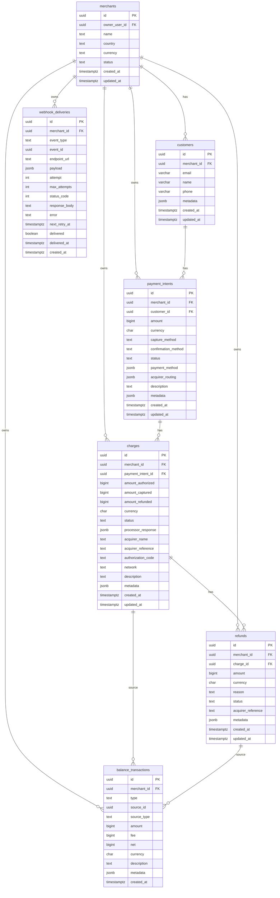

# Canonical Data Schema - MVP Documentation

## Overview

This document describes the **Canonical Data Schema** for DeonPay's multi-acquirer payment processing platform. The schema provides a unified data model that abstracts away provider-specific details (Stripe, Conekta, OpenPay, etc.) into a consistent, predictable structure.

## Design Principles

1. **Merchant Isolation**: All resources are scoped to `merchant_id` with RLS enforcement
2. **Minor Units**: All monetary amounts stored as `BIGINT` in minor units (centavos/cents)
3. **Currency Codes**: ISO 4217 3-letter codes (MXN, USD, etc.)
4. **Idempotent Migrations**: Safe to re-run without errors
5. **Audit Trail**: `created_at` and `updated_at` timestamps on all mutable tables
6. **Foreign Keys**: Explicit relationships with cascading deletes where appropriate
7. **Status Constraints**: CHECK constraints prevent invalid states

## Architecture

```
┌─────────────────────────────────────────────────────────────────────┐
│                          DeonPay Platform                            │
├─────────────────────────────────────────────────────────────────────┤
│  Landing → Dashboard → Hub → API Worker (Cloudflare)                │
│                                                                       │
│  Supabase Postgres (RLS Enabled)                                    │
│  └─ Canonical Data Schema (MVP)                                     │
└─────────────────────────────────────────────────────────────────────┘
```

## Entity Relationship Diagram



## Database Tables

### 1. customers

**Purpose**: Store customer/buyer information scoped to merchant

**Key Fields**:
- `merchant_id`: Merchant owner (FK to merchants)
- `email`, `name`, `phone`: Customer identity
- `metadata`: Additional key-value data

**Indexes**:
- `idx_customers_merchant` on `(merchant_id, created_at DESC)`
- `idx_customers_email` on `(merchant_id, email)` where email IS NOT NULL

**RLS**: Merchant-scoped SELECT/INSERT/UPDATE/DELETE policies

---

### 2. payment_intents

**Purpose**: Top-level payment orchestration object tracking full payment lifecycle

**Key Fields**:
- `merchant_id`: Merchant owner
- `customer_id`: Optional customer reference
- `amount`: Amount in minor units (BIGINT)
- `currency`: ISO 4217 code (CHAR(3), default 'MXN')
- `capture_method`: 'automatic' | 'manual'
- `confirmation_method`: 'automatic' | 'manual'
- `status`: Payment lifecycle state (CHECK constraint)
- `payment_method`: Canonical PM representation (JSONB)
- `acquirer_routing`: Multi-acquirer routing info (JSONB)

**Status Values**:
- `requires_payment_method`: Initial state
- `requires_action`: Needs customer action (3DS)
- `processing`: Being processed
- `succeeded`: Payment completed
- `canceled`: Canceled before completion
- `failed`: Failed to process

**Indexes**:
- `idx_pi_merchant` on `(merchant_id, created_at DESC)`
- `idx_pi_customer` on `customer_id`
- `idx_pi_status` on `(merchant_id, status)`
- `idx_pi_created` on `created_at DESC`

**RLS**: Merchant-scoped SELECT/INSERT/UPDATE policies

---

### 3. charges

**Purpose**: Individual charge attempts against a payment intent

**Key Fields**:
- `merchant_id`: Merchant owner
- `payment_intent_id`: Parent payment intent (FK)
- `amount_authorized`: Authorized amount (BIGINT)
- `amount_captured`: Actually captured amount
- `amount_refunded`: Total refunded from this charge
- `status`: Charge lifecycle state
- `processor_response`: Raw processor response (JSONB)
- `acquirer_name`: Processor used (e.g., "stripe", "conekta")
- `acquirer_reference`: Processor's charge ID
- `authorization_code`: Auth code from network
- `network`: Card network (visa, mastercard, etc.)

**Status Values**:
- `authorized`: Card authorized but not captured
- `captured`: Funds captured
- `partially_refunded`: Some funds refunded
- `refunded`: Fully refunded
- `voided`: Authorization voided
- `failed`: Charge failed

**Indexes**:
- `idx_charges_pi` on `payment_intent_id`
- `idx_charges_merchant` on `(merchant_id, created_at DESC)`
- `idx_charges_status` on `(merchant_id, status)`
- `idx_charges_acquirer_ref` on `acquirer_reference`

**RLS**: Merchant-scoped SELECT/INSERT/UPDATE policies

**Triggers**:
- `trg_charge_balance_transaction`: Auto-creates balance_transaction when captured

---

### 4. refunds

**Purpose**: Refund records tied to charges

**Key Fields**:
- `merchant_id`: Merchant owner
- `charge_id`: Parent charge (FK)
- `amount`: Refund amount in minor units
- `reason`: Optional refund reason
- `status`: 'pending' | 'succeeded' | 'failed'
- `acquirer_reference`: Processor's refund ID

**Indexes**:
- `idx_refunds_charge` on `charge_id`
- `idx_refunds_merchant` on `(merchant_id, created_at DESC)`
- `idx_refunds_status` on `(merchant_id, status)`

**RLS**: Merchant-scoped SELECT/INSERT/UPDATE policies

**Triggers**:
- `trg_refund_balance_transaction`: Auto-creates balance_transaction when succeeded

---

### 5. balance_transactions

**Purpose**: Ledger of all balance movements for merchant reconciliation

**Key Fields**:
- `merchant_id`: Merchant owner
- `type`: 'charge' | 'refund' | 'fee' | 'adjustment' | 'payout'
- `source_id`: Reference to charge/refund/payout
- `source_type`: Type of source object
- `amount`: Gross amount (can be negative)
- `fee`: Fee charged
- `net`: Net amount (amount - fee)

**Indexes**:
- `idx_bt_merchant_created` on `(merchant_id, created_at DESC)`
- `idx_bt_type` on `(merchant_id, type)`
- `idx_bt_source` on `source_id`

**RLS**: Merchant-scoped SELECT/INSERT policies

**Note**: Balance transactions are immutable (no UPDATE/DELETE policies)

---

### 6. webhook_deliveries

**Purpose**: Observability log for webhook delivery attempts per merchant

**Key Fields**:
- `merchant_id`: Merchant owner
- `event_type`: Event name (e.g., "payment.succeeded")
- `event_id`: Reference to payment_intent/charge/etc
- `endpoint_url`: Destination URL
- `payload`: Full webhook payload (JSONB)
- `attempt`: Current attempt number
- `max_attempts`: Maximum retry attempts (default 3)
- `status_code`: HTTP response code
- `delivered`: Success flag
- `next_retry_at`: Next retry timestamp

**Indexes**:
- `idx_webhook_deliveries_merchant` on `(merchant_id, created_at DESC)`
- `idx_webhook_deliveries_event` on `event_type`
- `idx_webhook_deliveries_delivered` on `(delivered, next_retry_at)` where NOT delivered

**RLS**: Merchant-scoped SELECT/INSERT policies

---

## Row Level Security (RLS)

All tables use the existing RLS pattern:

```sql
-- SELECT policy example
CREATE POLICY "Merchants can view their own {table}"
  ON {table} FOR SELECT
  USING (merchant_id IN (
    SELECT id FROM merchants WHERE owner_user_id = auth.uid()
  ));

-- INSERT policy example
CREATE POLICY "Merchants can create their own {table}"
  ON {table} FOR INSERT
  WITH CHECK (merchant_id IN (
    SELECT id FROM merchants WHERE owner_user_id = auth.uid()
  ));
```

This ensures:
1. Users can only access their own merchant's data
2. Database-level enforcement (can't be bypassed)
3. Automatic filtering in all queries

---

## Compatibility Notes

### Existing Schema Mapping

| Canonical | Existing | Notes |
|-----------|----------|-------|
| `merchant_id` | `merchant_id` | Uses existing merchants table |
| `webhooks` table | `webhooks` table | Already exists (002_webhooks_only.sql) |
| `webhook_events` table | `webhook_events` table | Already exists for per-webhook tracking |
| `webhook_deliveries` table | NEW | Per-merchant observability log |
| `update_updated_at_column()` | EXISTS | Reused from 001_onboarding_min.sql |
| RLS pattern | EXISTS | Follows existing pattern |

### No Breaking Changes

- All migrations are idempotent
- No existing tables renamed or dropped
- Foreign keys respect existing structure
- Triggers use existing functions

---

## Installation

### Prerequisites

1. Supabase Postgres database
2. Existing `merchants` table (from 001_onboarding_min.sql)
3. Existing `update_updated_at_column()` function

### Apply Migration

**Option 1: Supabase SQL Editor**

1. Go to https://supabase.com/dashboard/project/_/sql
2. Copy contents of `infra/migrations/020_canonical_data_schema.sql`
3. Click "Run"

**Option 2: psql CLI**

```bash
cd infra/migrations
psql -h <host> -U <user> -d <database> -f 020_canonical_data_schema.sql
```

**Option 3: Supabase CLI**

```bash
supabase db push
```

### Verify Migration

Run the verification script to ensure all tables, indexes, and policies are created:

```bash
cd infra/scripts
psql -h <host> -U <user> -d <database> -f verify_canonical_schema.sql
```

Expected output: All checks should show `✓ PASS`

---

## TypeScript Integration

### Install Dependencies

```bash
cd api-worker
npm install zod
```

### Import Schemas

```typescript
import {
  Customer,
  CreateCustomer,
  PaymentIntent,
  CreatePaymentIntent,
  Charge,
  Refund,
  CreateRefund,
  BalanceTransaction,
  WebhookDelivery,
  toMinorUnits,
  toMajorUnits,
  formatAmount,
} from './schemas/canonical'
```

### Usage Examples

#### Create Payment Intent

```typescript
import { CreatePaymentIntentSchema, toMinorUnits } from './schemas/canonical'

// Validate request body
const body = CreatePaymentIntentSchema.parse({
  amount: toMinorUnits(100.50), // $100.50 MXN = 10050 centavos
  currency: 'MXN',
  capture_method: 'automatic',
  metadata: {
    order_id: 'ord_123',
  },
})

// body is now type-safe: CreatePaymentIntent
```

#### Validate Payment Method

```typescript
import { PaymentMethodSchema } from './schemas/canonical'

const pm = PaymentMethodSchema.parse({
  brand: 'visa',
  last4: '4242',
  exp_month: 12,
  exp_year: 2025,
  token_ref: 'tok_abc123',
})
```

#### Create Refund

```typescript
import { CreateRefundSchema, toMinorUnits } from './schemas/canonical'

const refund = CreateRefundSchema.parse({
  charge_id: 'ch_uuid_here',
  amount: toMinorUnits(50.00), // Partial refund
  reason: 'Customer requested refund',
})
```

#### Format Amounts

```typescript
import { formatAmount, toMinorUnits } from './schemas/canonical'

const amount = toMinorUnits(100.50) // 10050
console.log(formatAmount(amount, 'MXN', 'es-MX'))
// Output: "$100.50 MXN"
```

---

## API Endpoint Examples

### Expected REST API Structure

```
POST   /api/v1/customers
GET    /api/v1/customers/:id
PATCH  /api/v1/customers/:id
DELETE /api/v1/customers/:id
GET    /api/v1/customers

POST   /api/v1/payment_intents
GET    /api/v1/payment_intents/:id
PATCH  /api/v1/payment_intents/:id
POST   /api/v1/payment_intents/:id/confirm
POST   /api/v1/payment_intents/:id/capture
POST   /api/v1/payment_intents/:id/cancel
GET    /api/v1/payment_intents

GET    /api/v1/charges/:id
GET    /api/v1/charges

POST   /api/v1/refunds
GET    /api/v1/refunds/:id
GET    /api/v1/refunds

GET    /api/v1/balance/transactions
GET    /api/v1/balance/transactions/:id

GET    /api/v1/webhook_deliveries
GET    /api/v1/webhook_deliveries/:id
```

### Authentication

All API requests must include API key from `api_keys` table:

```
Authorization: Bearer pk_test_abc123...
```

or

```
Authorization: Bearer sk_live_xyz789...
```

---

## Payment Flow Example

### 1. Create Payment Intent

```http
POST /api/v1/payment_intents
Content-Type: application/json
Authorization: Bearer pk_test_abc123

{
  "amount": 10050,
  "currency": "MXN",
  "customer_id": "cus_uuid",
  "capture_method": "automatic",
  "metadata": {
    "order_id": "ord_123"
  }
}
```

**Response**:
```json
{
  "id": "pi_uuid",
  "status": "requires_payment_method",
  "amount": 10050,
  "currency": "MXN",
  "created_at": "2025-11-09T..."
}
```

### 2. Confirm with Payment Method

```http
POST /api/v1/payment_intents/pi_uuid/confirm
Content-Type: application/json
Authorization: Bearer pk_test_abc123

{
  "payment_method": {
    "brand": "visa",
    "last4": "4242",
    "exp_month": 12,
    "exp_year": 2025,
    "token_ref": "tok_stripe_abc123"
  }
}
```

**Response**:
```json
{
  "id": "pi_uuid",
  "status": "processing",
  "payment_method": {
    "brand": "visa",
    "last4": "4242"
  },
  "acquirer_routing": {
    "selected": "stripe",
    "candidates": ["stripe", "conekta"],
    "routing_strategy": "cost_optimization"
  }
}
```

### 3. Payment Succeeds (Webhook)

System creates:
- `charges` record with `status: 'captured'`
- `balance_transactions` record (via trigger)
- `webhook_deliveries` record for merchant webhook

### 4. Issue Refund

```http
POST /api/v1/refunds
Content-Type: application/json
Authorization: Bearer sk_live_xyz789

{
  "charge_id": "ch_uuid",
  "amount": 5000,
  "reason": "Customer requested partial refund"
}
```

Updates:
- `refunds` table with new record
- `charges.amount_refunded` incremented
- `charges.status` updated to 'partially_refunded'
- `balance_transactions` record created (via trigger)

---

## Monitoring & Observability

### Key Queries

**Check merchant balance**:
```sql
SELECT
  merchant_id,
  SUM(net) as balance,
  currency
FROM balance_transactions
WHERE merchant_id = :merchant_id
GROUP BY merchant_id, currency;
```

**Failed webhook deliveries**:
```sql
SELECT
  event_type,
  endpoint_url,
  attempt,
  error,
  created_at
FROM webhook_deliveries
WHERE merchant_id = :merchant_id
  AND delivered = false
ORDER BY created_at DESC;
```

**Recent payment intents**:
```sql
SELECT
  id,
  amount,
  currency,
  status,
  created_at
FROM payment_intents
WHERE merchant_id = :merchant_id
ORDER BY created_at DESC
LIMIT 10;
```

**Charge success rate**:
```sql
SELECT
  merchant_id,
  COUNT(*) FILTER (WHERE status = 'captured') as successful,
  COUNT(*) FILTER (WHERE status = 'failed') as failed,
  ROUND(
    100.0 * COUNT(*) FILTER (WHERE status = 'captured') / COUNT(*),
    2
  ) as success_rate
FROM charges
WHERE merchant_id = :merchant_id
  AND created_at >= NOW() - INTERVAL '30 days'
GROUP BY merchant_id;
```

---

## Testing

### Sample Test Data

```sql
-- Insert test customer
INSERT INTO customers (merchant_id, email, name)
VALUES (:merchant_id, 'test@example.com', 'Test Customer')
RETURNING id;

-- Insert test payment intent
INSERT INTO payment_intents (
  merchant_id,
  customer_id,
  amount,
  currency,
  capture_method,
  status
) VALUES (
  :merchant_id,
  :customer_id,
  10050,
  'MXN',
  'automatic',
  'requires_payment_method'
) RETURNING id;

-- Insert test charge
INSERT INTO charges (
  merchant_id,
  payment_intent_id,
  amount_authorized,
  amount_captured,
  currency,
  status,
  acquirer_name
) VALUES (
  :merchant_id,
  :payment_intent_id,
  10050,
  10050,
  'MXN',
  'captured',
  'stripe'
) RETURNING id;
```

### Cleanup Test Data

```sql
-- Delete all test data for a merchant
DELETE FROM customers WHERE merchant_id = :test_merchant_id;
DELETE FROM payment_intents WHERE merchant_id = :test_merchant_id;
DELETE FROM charges WHERE merchant_id = :test_merchant_id;
DELETE FROM refunds WHERE merchant_id = :test_merchant_id;
DELETE FROM balance_transactions WHERE merchant_id = :test_merchant_id;
DELETE FROM webhook_deliveries WHERE merchant_id = :test_merchant_id;
```

---

## Troubleshooting

### Migration Failed

**Issue**: Migration returns error on existing table

**Solution**: Migrations are idempotent. Re-run the migration - it will skip existing objects.

### RLS Blocking Queries

**Issue**: Queries return empty results even though data exists

**Solution**: Ensure `auth.uid()` is set:
```sql
SELECT auth.uid(); -- Should return user UUID
```

For testing, temporarily disable RLS:
```sql
ALTER TABLE payment_intents DISABLE ROW LEVEL SECURITY;
```

### Trigger Not Firing

**Issue**: Balance transactions not created automatically

**Solution**: Verify triggers exist:
```sql
SELECT * FROM information_schema.triggers
WHERE event_object_table IN ('charges', 'refunds');
```

### Foreign Key Violations

**Issue**: Cannot insert payment_intent with invalid merchant_id

**Solution**: Ensure merchant exists:
```sql
SELECT id FROM merchants WHERE id = :merchant_id;
```

---

## Next Steps

1. **API Worker Implementation**: Build Cloudflare Worker with Hono for REST API
2. **Acquirer Adapters**: Create adapters for Stripe, Conekta, OpenPay
3. **Routing Logic**: Implement multi-acquirer routing strategy
4. **Webhook System**: Build webhook delivery and retry system
5. **Dashboard Integration**: Add payment views to merchant dashboard
6. **Hub Integration**: Add admin payment monitoring to internal hub

---

## Support

For questions or issues:
1. Check [DEONPAY_ECOSYSTEM_DOCUMENTATION.md](../DEONPAY_ECOSYSTEM_DOCUMENTATION.md)
2. Review migration files in `/infra/migrations/`
3. Run verification script: `/infra/scripts/verify_canonical_schema.sql`
4. Check Supabase logs for RLS/trigger issues

---

## Changelog

### Version 020 (2025-11-09)
- Initial canonical schema implementation
- 6 core tables: customers, payment_intents, charges, refunds, balance_transactions, webhook_deliveries
- Complete RLS policies for merchant isolation
- Auto-balance transaction triggers
- Zod schemas for TypeScript validation
- Comprehensive documentation with ER diagram
